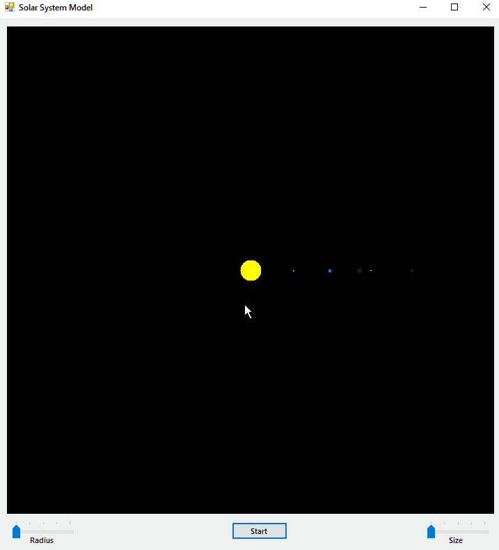
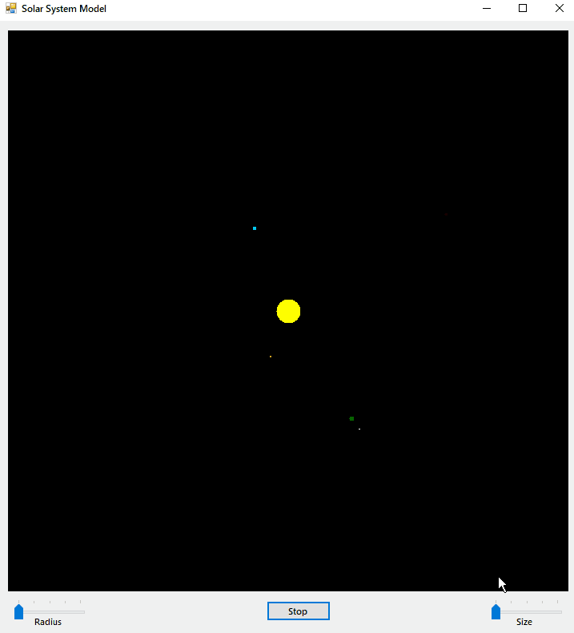

# Solar System Model in C++/CLR (Windows Forms Visual C++)

One day someone asked me to write a program for modeling the Solar System. Using the capabilities of the modern Internet, I did it.

## Description

Task: object-oriented programming of an astronomical model of the Solar System. The model represents the Sun and the planets Mercury, Venus, Earth, Mars and their satellites.

The program works as described below:

- [x] The screen shows the Sun and the planets with their satellites. They are placed around the Sun at their astronomical positions.
- [x] The planets begin to rotate around the Sun on their orbits with the correct ratio of velocities. At the same time, the satellites begin to rotate around their planets along trajectories consisting of two rotational motions: the rotation of the planet around the Sun and the rotation of the satellite around the planet.
- [x] To generalize the definitions of different celestial bodies, define the `TBody` object.
- [x] Planets and satellites, just like the Sun, are celestial bodies. They should be defined as heir objects to the `TBody' object.
- [x] Heir objects must contain fields:
  - [x] 1. the current coordinates of the celestial body;
  - [x] 2. the center around which the body rotates;
  - [x] 3. the orbital radius;
  - [x] 4. the satellite list;
  - [x] 5. the rotation speed;
  - [x] 6. the size of the celestial body;
  - [x] 7. the color of the celestial body.
- [x] The rotation of both planets and satellites around the central body follows the same rules of nature.
- [x] The sun is to the planets the body around which they revolve, some planet is also to each satellite. This motion for all celestial bodies can be determined by one method - `rotate()`.
- [x] The idea of the method is to make body movements by building up angular movement in increments of 10 degrees.
- [x] The displacement of each celestial body is calculated as a relative value depending on the value of its speed.
- [x] Each time the angle is changed, the new coordinates of the body position are calculated.
- [x] Each planet, having begun to rotate, must launch an appropriate rotation method for its satellites.
- [x] Relative parameters for planets and satellites are:

| Title   | Radius | Speed | Size |
| ------- | ------ | ----- | ---- |
| Mercury | 58     | 0.416 | 3    |
| Venus   | 108    | 0.416 | 5    |
| Earth   | 150    | 0.1   | 6    |
| Mars    | 228    | 0.053 | 4    |
| Moon    | 15     | 1.3   | 2    |
| Phobos  | 7      | 114.4 | 1    |
| Deimos  | 12     | 30.4  | 1    |

> Yes, a lot of things are described here are very complicated, but in fact, the main thing here is to understand the meaning of the table.

## Demonstration

### General Demonstration of the Program

### Start/Stop Animation Operation

### Changing the Size Coefficient of Celestial Bodies

### Changing the Radius Coefficient of Celestial Bodies

## License

[MIT](LICENSE.md)
