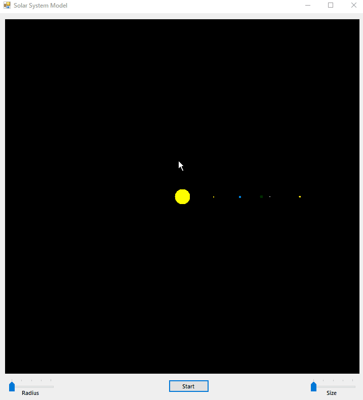
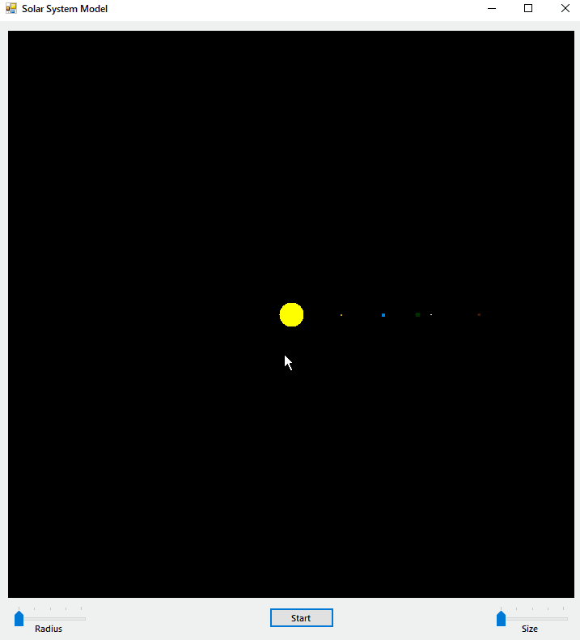
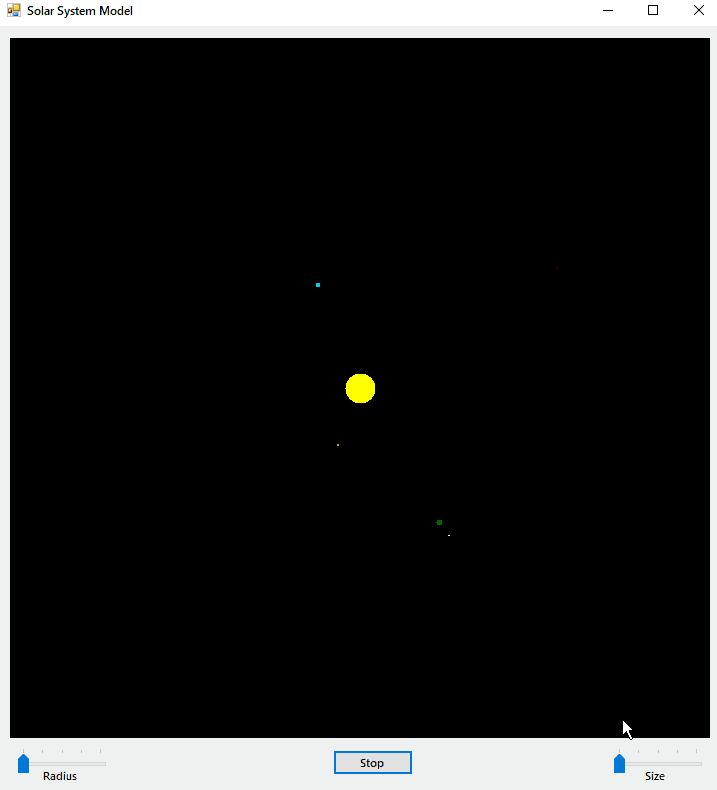
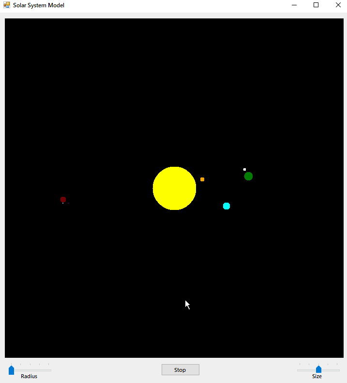

# Модель Солнечной системы на C++/CLR (Windows Forms Visual C++) #

Однажды какой-то человек попросил меня написать программу для моделирования Солнечной системы. Используя возможности современного Интернета, я это сделал.

## Описание ##

Задание: объектно-ориентированное программирование астрономической модели солнечной системы. Модель описывает Солнце и планеты Меркурий, Венеру, Землю, Марс и их спутники.

Программа работает следующим образом:

- [x] На экране изображается Солнце и планеты со своими спутниками. Они располагаются вокруг Солнца на своих астрономических местах.
- [x] Планеты начинают вращаться вокруг Солнца по своим орбитам с правильным соотношением скоростей. В то же время спутники начинают вращаться вокруг своих планет по траекториям, складывающимся из двух вращательных движений: вращение планеты вокруг Солнца и вращение спутника вокруг планеты.
- [x] Чтобы обобщить определения разных небесных тел, определите объект `TBody`.
- [x] Планеты и спутники так же, как и Солнце, - это небесные тела. Их надо определить как объекты-наследники от `TBody`.
- [x] Объекты-наследники должны содержать поля:
  - [x] 1) текущие координаты тела;
  - [x] 2) центр, вокруг которого тело вращается;
  - [x] 3) радиус орбиты;
  - [x] 4) список спутников;
  - [x] 5) скорость вращения;
  - [x] 6) размер;
  - [x] 7) цвет тела.
- [x] Вращение как планет, так и спутников вокруг центрального тела происходит по одним и тем же законом природы.
- [x] Для планет телом, вокруг которого они вращаются, является Солнце, а для каждого спутника некоторая планета. Это движение для всех небесных тел можно определить одним методом - _Вращайся!_.
- [x] Идея метода состоит в осуществлении движения тела наращиванием углового перемещения с шагом в 10 градусов.
- [x] Перемещение каждого тела вычисляется в виде относительной величины, зависящей от значения его скорости.
- [x] При каждом изменении угла вычисляются новые координаты положения тела.
- [x] Каждая планета, начав вращаться должна запустить соответствующий метод вращения для своих спутников.
- [x] Относительные параметры для планет и спутников:

Название | Радиус | Скорость | Размер
---------|--------|----------|-------
Меркурий | 58     | 0.416    | 3
Венера   | 108    | 0.416    | 5
Земля    | 150    | 0.1      | 6
Марс     | 228    | 0.053    | 4
Луна     | 15     | 1.3      | 2
Фобос    | 7      | 114.4    | 1
Деймос   | 12     | 30.4     | 1

> Да, многое здесь описано очень сложно, но на самом деле, здесь главное понять смысл таблицы.

## Демонстрация ##

### Общая демонстрация работы программы ###

### Работа запуска/остановки анимации ###

### Изменение коэффициента размеров небесных тел ###

### Изменения коэффициента радиуса небесных тел ###

## Лицензия ##

[MIT](LICENSE.md)